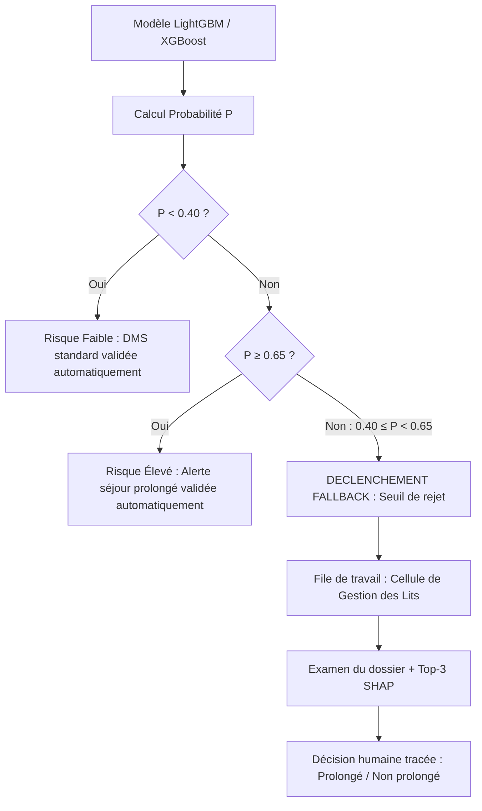
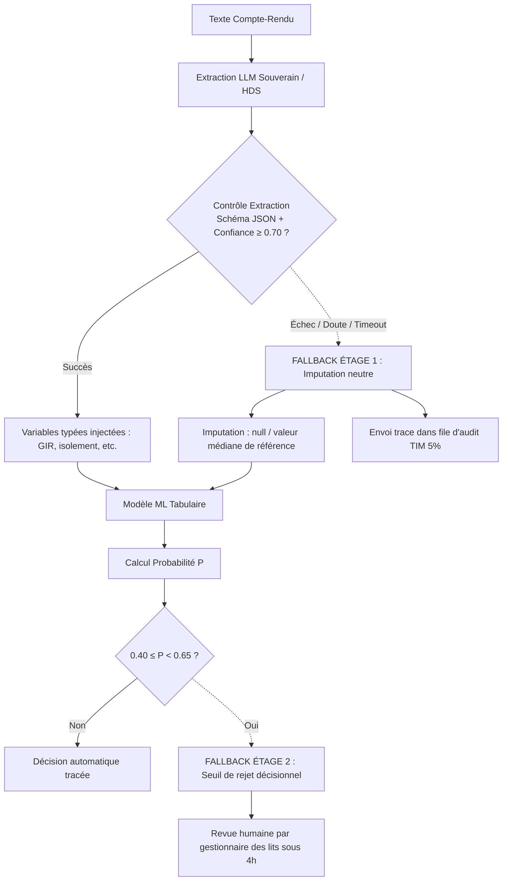
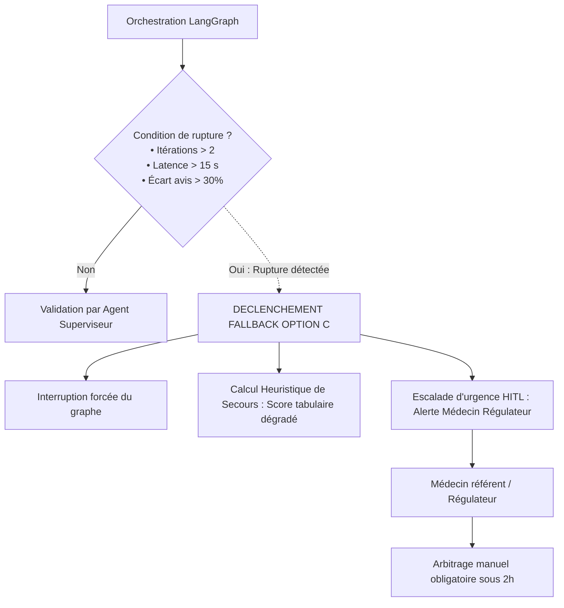

# Spécification des Fallback Strategies en Conception — MediVox

> **Cadre méthodologique** : Mini-cours `05_Fallback_strategies_conception_essentiel.md`  
> **Principe clé** : Un fallback n'est pas une intention vague (« on met un humain »), c'est une **procédure opérationnelle formelle** répondant à 6 questions : **Qui**, **Quand (condition de déclenchement)**, **Comment (mécanisme de repli)**, **Délai**, **Autorité de décision** et **Traçabilité**.  
> **Distinction essentielle** : Il s'agit ici de mécanismes de repli intégrés dès l'**architecture de conception** (gestion de l'incertitude et des pannes prévues), distincts de la réaction à la dérive (drift M6 en exploitation).

---

## Synthèse comparée des 3 stratégies de repli

| Option | Type de repli principal | Condition de déclenchement | Action automatique immédiate | Procédure humaine (HITL) | Délai max |
|---|---|---|---|---|---|
| **A — ML classique modernisé** | **Seuil de rejet / Abstention** | Probabilité de risque ambiguë : $0{,}40 \le P < 0{,}65$ | Pas de décision automatique ; statut « En attente revue » | Revue du dossier par le gestionnaire des lits avec les 3 facteurs SHAP clés | 4 heures |
| **B — Hybride LLM extraction → ML** | **Double fallback étagé** : 1. Imputation neutre (`null`) 2. Seuil de rejet décisionnel | 1. Échec format JSON / Timeout LLM / Score certitude < 0.70 2. $0{,}40 \le P < 0{,}65$ | 1. Imputation par valeur neutre (médiane) pour ne pas bloquer le ML 2. Score ML transmis avec alerte | 1. File d'audit qualité asynchrone (échantillon 5 % par TIM) 2. Revue clinique par gestionnaire de lits | 1. 48 heures (audit) 2. 4 heures (lits) |
| **C — Multi-agents (LangGraph)** | **Interruption de boucle + Heuristique dégradée + Escalade** | • Récursion > 2 boucles • Désaccord inter-agents > 30 % • Timeout graphe > 15 s | Coupure immédiate du graphe ; calcul d'un score de secours tabulaire simple | Notification d'urgence au médecin régulateur avec trace complète des échanges d'agents | 2 heures |

---

## 1. Option A — Procédure de Seuil de Rejet (Incertitude probabiliste)

### 1.1 Risque traité & Cadre légal
* **Risque métier** : Risque d'erreur d'orientation (faux positif : rétention indue d'un lit ; faux négatif : saturation non anticipée).
* **Cadre juridique** : Respect de l'article 22 du RGPD (refus de la décision exclusivement automatisée à impact significatif) et article 14 de l'AI Act (supervision humaine effective).

### 1.2 Spécification opérationnelle

* **Déclencheur (Quand ?)** : Lorsque la probabilité calibrée $P(\text{séjour prolongé})$ se situe dans la plage d'ambiguïté $[0{,}40 ; 0{,}65]$. Cela concerne environ 12 % des admissions ($H_6$).
* **Comportement système (Comment ?)** : L'automate refuse de statuer. Il flaggue le dossier avec le statut `EN_ATTENTE_ARBITRAGE` et génère un ticket de travail dans l'outil de gestion des lits.
* **Acteur humain (Qui ?)** : Le cadre soignant ou le gestionnaire de lits de garde de l'établissement.
* **Autorité & Pouvoir de contredire** : L'opérateur humain dispose de la pleine autorité décisionnelle pour classer le séjour en prolongé ou standard. Il s'appuie sur le Top-3 des variables explicatives SHAP fournies par l'interface.
* **Délai opérationnel** : Traitement sous **4 heures** (avant la réunion de régulation des lits de 14h ou 18h).
* **Traçabilité** : Enregistrement dans les logs : `ID_Dossier`, `Score_ML_brut`, `SHAP_values`, `Decision_Humaine`, `ID_Operateur`, `Horodatage`.

---

## 2. Option B — Procédure de Double Fallback Étagé (Extraction & Décision)

### 2.1 Risques traités & Cadre légal
* **Risque Étage 1 (Extraction textuelle)** : Hallucination du LLM, timeout de l'API HDS, ou non-respect du schéma JSON imposé qui injecterait des variables aberrantes dans le modèle tabulaire.
* **Risque Étage 2 (Décisionnelle)** : Incertitude sur la probabilité finale du patient.

### 2.2 Spécification opérationnelle

* **Étage 1 — Fallback d'extraction non-bloquant** :
  * *Déclencheur* :
    1. Validation Pydantic échouée (format JSON corrompu, types erronés).
    2. Absence de la phrase source citée dans le texte original (détection d'hallucination).
    3. Score de certitude du LLM $< 0{,}70$.
    4. Timeout de réponse LLM $> 4\,000$ ms.
  * *Action technique* : Les variables textuelles manquantes ou douteuses sont immédiatement remplacées par la valeur par défaut neutre (imputation `null` ou médiane de cohorte). **Le pipeline ne s'arrête pas** : le modèle ML prédit avec les features structurées disponibles et une feature indicateur `is_text_imputed = True`.
  * *Contrôle humain asynchrone* : Le compte-rendu et le log d'erreur sont routés dans une file d'audit qualité échantillonnée (5 % des dossiers) traitée de façon différée sous **48 heures** par un Technicien de l'Information Médicale (TIM) pour réajuster le prompt ou identifier une dérive lexicale.
* **Étage 2 — Fallback de prédiction** :
  * Même procédure que l'Option A (revue humaine par le gestionnaire des lits sous 4 h si $P \in [0{,}40 ; 0{,}65]$).

---

## 3. Option C — Procédure de Repli Multi-Agents (Anti-boucle & Dégradation de service)

### 3.1 Risques traités & Cadre légal
* **Risques spécifiques multi-agents** :
  * Boucle infinie de contestation entre agents (l'agent clinique refuse l'avis de l'agent médico-social).
  * Latence cumulative dépassant le temps utile pour les urgences.
  * Perte de contrôle sur le raisonnement (hallucination croisée collective).
* **Cadre juridique** : Article 14 de l'AI Act (Obligation d'un bouton d'arrêt d'urgence et de reprise en main humaine sur les systèmes autonomes).

### 3.2 Spécification opérationnelle

* **Déclencheurs (Quand ?)** :
  1. *Limite d'itérations (*recursion limit*)* : le graphe effectue plus de 2 allers-retours de contestation entre agents.
  2. *Désaccord irréconciliable* : l'Agent Clinique et l'Agent Psycho-Social attribuent des scores d'impact divergents de plus de $30\,\%$.
  3. *Timeout système* : temps d'exécution global dépassant $15$ secondes.
* **Action technique (Comment ?)** :
  1. **Kill-switch** : Interruption immédiate de l'orchestration des agents.
  2. **Heuristique de secours (Fail-soft)** : Exécution d'un modèle de repli tabulaire ultraléger (ou score basé sur règles métier codées en dur) pour fournir un ordre de grandeur conservateur d'attente.
* **Acteur humain & Procédure (Qui & Autorité)** :
  * Escalade directe vers le **médecin coordonnateur des urgences / régulateur de garde**.
  * L'interface lui présente un écran d'audit synthétisant les désaccords entre agents et le texte du compte-rendu original.
  * Le médecin a l'autorité exclusive d'arbitrage. Aucune décision automatisée n'est validée en mode dégradé.
* **Délai opérationnel** : **2 heures** maximum compte tenu du contexte d'urgence hospitalière.
* **Traçabilité** : Capture intégrale du *Shared State* (mémoire tampon du graphe), des prompts intermédiaires et de la cause de rupture (`TIMEOUT`, `MAX_ITERATIONS`, `DISAGREEMENT`).

---

## 4. Synthèse pour la note d'arbitrage

Le tableau de conception démontre que la maturité opérationnelle décroît fortement de A vers C :
- L'**Option A** dispose d'un fallback sobre, transparent, totalement maîtrisé et parfaitement aligné avec le rôle des cadres de santé.
- L'**Option B** protège la continuité du service par son **imputation neutre** : une panne du LLM ne paralyse jamais la gestion des lits.
- L'**Option C** introduit une machinerie de sécurité lourde (kill-switch, score de secours, alerte médecin) rendue obligatoire par la fragilité intrinsèque de l'orchestration multi-agents.
