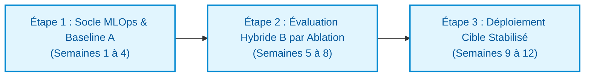

# Note de comparaison — Évolution du prédicteur de séjour prolongé (MediVox)

> **Destinataire** : Hélène Tournier, Directrice des Systèmes d'Information & Karim  
> **Auteurs** : Franck Beugnet & Joelle Germanos (Équipe IA / Atos)  
> **Date** : 23 septembre 2026 — Version finale arbitrage d'architecture  
> **Format** : Synthèse exécutive d'aide à la décision (3 pages maximum)

---

> ### 📌 Décision en une phrase
> **Nous recommandons de moderniser l'existant en Machine Learning classique (Option A) avec seuil d'abstention et explicabilité SHAP, tout en conditionnant l'adoption d'un extracteur LLM hybride (Option B) à la preuve formelle par protocole d'ablation d'un gain de F1 supérieur à +0,05.**

---

## 1. Synthèse exécutive & Réponse au besoin (3 min)

Suite à l'audit M7-B1, la DSI s'interroge sur l'opportunité d'intégrer des technologies génératives (LLM, RAG, agents) pour améliorer le « prédicteur DMS » (Durée Moyenne de Séjour). Notre analyse établit trois constats structurants :

1. **Clarification sur le RAG** : Un RAG est un système de question-réponse documentaire ; il ne calcule aucun score de risque et ne prédit rien. Pour faire contribuer les comptes-rendus médicaux à la prédiction, la seule approche valide est une architecture **hybride (Option B)** où un LLM extrait des variables cliniques normalisées sous schéma JSON strict pour nourrir un modèle tabulaire.
2. **Le piège du sur-engineering multi-agents (Option C)** : Orchestrer un collège d'agents pour prédire une durée de séjour multiplie le coût par 25 à 35, induit une latence inacceptable aux urgences (> 12 s) et dégrade la calibration probabiliste par rapport à un modèle tabulaire.
3. **Le verdict de sobriété et d'efficacité** : Sur un problème de décision tabulaire hospitalière, **l'Option A (ML classique modernisé)** répond immédiatement aux enjeux d'explicabilité, de conformité HDS/RGPD et de sobriété économique (~50 €/mois contre ~300 € pour B et ~1 500 € pour C), tout en hissant le $F_1$-score de 0,68 à 0,72 grâce à un seuil d'abstention calibré.

---

## 2. Présentation synthétique des 3 options

### Option A — ML classique modernisé (Baseline industrielle optimisée)
* **Principe** : Ré-entraînement d'un modèle de Gradient Boosting (LightGBM/XGBoost) sur données administratives et médico-économiques structurées du DPI/PMSI, enrichi d'un calcul d'explicabilité locale SHAP et d'un monitoring continu de dérive (Evidently).
* **Indicateurs clés** : Sobriété : **~50 € / mois** (~0,005 € / inférence) | Performance : **F1 = 0,72**, abstention 12 %, latence $p95 < 50$ ms | Conformité : **Fort** | Évolutivité : **Intermédiaire**.
* **Limitation** : Ne lit pas les signaux faibles du texte libre (isolement social, épuisement des aidants non codés).

### Option B — Hybride Extraction LLM → ML prédictif (Synergie texte-tabulaire)
* **Principe** : Pipeline à deux étages séquentiels : un LLM souverain/HDS extrait des variables ciblées (GIR présumé, fragilité sociale) sous format JSON contraint (Structured Outputs avec citation source). Ces variables complètent le vecteur tabulaire alimentant le modèle ML de prédiction.
* **Indicateurs clés** : Sobriété : **~250 à 400 € / mois** (~0,03 € / dossier) | Performance : **F1 = 0,76 à 0,78** (*gain potentiel conditionné au protocole d'ablation*) | Latence $p95 \approx 2{,}5$ s | Conformité : **Intermédiaire** | Évolutivité : **Fort**.
* **Limitation** : Coût récurrent lié aux tokens, latence d'extraction, dépendance à un socle LLM certifié HDS.

### Option C — Orchestration Multi-Agents (Graphe collaboratif LangGraph)
* **Principe** : Graphe d'agents spécialisés (ingestion, clinique somatique, médico-social, synthèse, superviseur de cohérence) échangeant via un état partagé pour produire un rapport textuel et un score de séjour.
* **Indicateurs clés** : Sobriété : **~1 200 à 1 800 € / mois** (~0,15 € / dossier) | Performance : **F1 = 0,70 à 0,73** (mauvaise calibration probabiliste, cascade d'erreurs) | Latence $p95 > 12$ s | Conformité : **Faible** | Évolutivité : **Faible**.
* **Limitation** : Sur-engineering critique, non-déterminisme décisionnel, coût et empreinte énergétique disproportionnés.

---

## 3. Synthèse de la matrice comparative 3 × 4

*(Détail complet des hypothèses H1 à H6 disponible dans `comparatif.md`)*

| Dimension | A — ML classique modernisé | B — Hybride LLM → ML | C — Multi-agents |
|---|---|---|---|
| **Sobriété** *(chiffrée)* | **~50 € / mois** (15 kWh/mois) *Risque : dérive MLOps sous-estimée* | **~250–400 € / mois** (80–120 kWh/mois) *Risque : hausse volumétrie textuelle* | **~1 200–1 800 € / mois** (400–600 kWh/mois) *Risque : emballement financier par boucles* |
| **Performance** *(chiffrée)* | **F1 = 0,72** \| Abs. 12 % \| **p95 < 50 ms** *Risque : plafond de verre sur non-structuré* | **F1 = 0,76–0,78** \| Abs. 8 % \| **p95 ≈ 2,5 s** *Risque : erreurs d'extraction LLM* | **F1 = 0,70–0,73** \| Abs. 18 % \| **p95 > 12 s** *Risque : variabilité et décalibration* |
| **Conformité** *(qualifiée)* | **Niveau FORT** (RGPD art. 22 & HDS natif) *Risque : opacité levée par SHAP* | **Niveau INTERMÉDIAIRE** (HDS obligatoire) *Risque : hallucinations encadrées par Pydantic* | **Niveau FAIBLE** (AI Act art. 13-14 difficile) *Risque : effet boîte noire multi-agents* |
| **Évolutivité** *(qualifiée)* | **Niveau INTERMÉDIAIRE** (tables aisées) *Point rupture : cécité textuelle* | **Niveau FORT** (schéma JSON extensible) *Point rupture : saturation contexte multi-séjours* | **Niveau FAIBLE** (graphe complexe à stabiliser) *Point rupture : explosion combinatoire* |

---

## 4. Fallback strategies de conception

Conformément aux exigences de sécurité médicale et de l'AI Act (supervision humaine effective) :

1. **Option A — Seuil de rejet d'incertitude** : Si $0{,}40 \le P(\text{séjour}) < 0{,}65$ (~12 % des dossiers), aucune décision automatique n'est validée. Le dossier est routé vers la cellule de gestion des lits (cadre soignant) avec ses facteurs d'explicabilité SHAP, pour arbitrage manuel sous un délai max de **4 heures**.
2. **Option B — Double repli étagé** :
   - *Étage 1 (Extraction)* : Si le LLM échoue, hallucine ou déroge au format JSON, injection d'une valeur neutre (`null` ou médiane) pour **ne jamais bloquer le pipeline prédictif** ; le dossier part en file d'audit qualité différée (échantillonnage 5 % relu sous 48 h par un TIM).
   - *Étage 2 (Décision)* : Application du seuil d'abstention identique à l'Option A (revue humaine sous 4 h).
3. **Option C — Kill-switch & bascule dégradée** : En cas de désaccord inter-agents > 30 %, de boucle > 2 itérations ou de timeout > 15 s, interruption d'urgence du graphe, exécution d'un score heuristique dégradé et escalade vers le médecin régulateur sous un délai max de **2 heures**.

---

## 5. Recommandation tranchée : L'Option A

Nous recommandons d'arbitrer immédiatement en faveur de l'**Option A (ML classique modernisé)**, étayée par **trois arguments majeurs** :

1. **Efficience économique et sobriété (Facteur 6 à 30)** : À ~50 €/mois, l'Option A garantit un coût par dossier de 0,005 €, sans dépendance GPU ni surcoût API, préservant l'empreinte environnementale hospitalière (~15 kWh/mois).
2. **Robustesse réglementaire et opérationnelle immédiate** : Zéro fuite de données de santé (données confinées au DPI), latence quasi nulle (< 50 ms compatible avec le flux d'admission des urgences), et explicabilité mathématique totale (valeurs SHAP opposables).
3. **Gain de performance sans risque d'hallucination** : L'introduction du seuil d'abstention porte le $F_1$-score de 0,68 à 0,72 sur la classe minoritaire sensible, éliminant les erreurs sur les dossiers ambigus sans introduire le risque d'artefacts textuels génératifs.

### Condition explicite de changement d'avis (Bascule vers Option B)
Nous ne reconsidérerons un passage vers l'architecture hybride (Option B) **qu'à l'unique condition** que le **protocole d'ablation** mené sur 1 000 dossiers étiquetés démontre un gain de performance statistiquement significatif ($\Delta F_1 \ge +0{,}05$, soit un $F_1 \ge 0{,}77$) attribuable aux variables textuelles extraites, tout en maintenant un taux d'erreur d'extraction vérifié inférieur à 5 %.

---

## 6. Garde-fou sobriété — Règle opérationnelle d'ingénierie

Pour prémunir l'établissement contre toute dérive budgétaire et technologique, nous soumettons à l'équipe d'Hélène la règle de gouvernance suivante :

> 🛑 **Règle d'or de sobriété MediVox** :  
> **« Aucun appel à un modèle de langage (LLM) ne doit être exécuté si l'information recherchée est déjà disponible sous forme structurée dans le DPI, ou si le modèle tabulaire atteint l'objectif clinique sans elle. »**

---

## 7. Plan de migration en 3 étapes

| Étape | Changement technique & organisationnel | Risque identifié | Critère formel de passage à l'étape suivante |
|---|---|---|---|
| **Étape 1 : Existant $\rightarrow$ Option A industrialisée** | • Ré-entraînement LightGBM avec feature store DPI. • Implémentation du seuil d'abstention ($[0{,}40 ; 0{,}65]$) et SHAP. • Mise en place du monitoring de dérive (Evidently). | Charge de travail des cadres soignants si volume de rejet $> 15\,\%$. | • $F_1 \ge 0{,}72$ sur le jeu de test holdout. • Taux d'abstention stabilisé $\le 12\,\%$. • Latence $p95 < 50$ ms validée. |
| **Étape 2 : Intermédiaire $\rightarrow$ Banc d'essai Hybride (Option B en ombre)** | • Intégration d'un LLM souverain HDS en mode shadow (asynchrone). • Extraction JSON contrôlée de 4 variables (autonomie, isolement). • Conduite du protocole d'ablation strict sur 1 000 dossiers. | Biais d'extraction ou hallucinations non détectées dans le texte libre. | • **Condition d'arbitrage** : $\Delta F_1 \ge +0{,}05$ prouvé par ablation. • Taux de conformité JSON $> 98\,\%$. • Coût unitaire d'extraction $\le 0{,}04$ € / dossier. |
| **Étape 3 : Cible $\rightarrow$ Déploiement en production & Audit continu** | • Si étape 2 validée : bascule vers l'Option B avec double fallback. • Si étape 2 non validée : maintien définitif de l'Option A pérenne. • Intégration dans le tableau de bord de la cellule de lits. | Rejet utilisateur par manque d'adhésion soignante. | • Disponibilité système $> 99{,}9\,\%$. • Satisfaction des équipes de régulation $> 80\,\%$. • Audit trimestriel AI Act & RGPD conforme. |
