# Option A — ML classique modernisé

```mermaid
flowchart LR
    %% ==========================================
    %% CONVENTION GRAPHIQUE UNIFIÉE OPTIONS A, B, C
    %% ==========================================
    classDef inputStyle fill:#E1F5FE,stroke:#0288D1,stroke-width:2px,color:#01579B;
    classDef processStyle fill:#E8F5E9,stroke:#388E3C,stroke-width:2px,color:#1B5E20;
    classDef modelStyle fill:#EDE7F6,stroke:#512DA8,stroke-width:2px,color:#311B92;
    classDef controlStyle fill:#FFF3E0,stroke:#F57C00,stroke-width:2px,color:#E65100;
    classDef decisionStyle fill:#FFFDE7,stroke:#FBC02D,stroke-width:2px,color:#F57F17;
    classDef outputStyle fill:#FCE4EC,stroke:#C2185B,stroke-width:2px,color:#880E4F;
    classDef fallbackStyle fill:#FFEBEE,stroke:#D32F2F,stroke-width:2px,stroke-dasharray: 5 5,color:#B71C1C;
    classDef dataStore fill:#ECEFF1,stroke:#455A64,stroke-width:2px,color:#263238;

    %% ==========================================
    %% COMPOSANTS DU PIPELINE OPTION A
    %% ==========================================
    subgraph S1["1. Sources & Données"]
        DPI[("DPI & PMSI<br/>(Données structurées)")]:::dataStore
    end

    subgraph S2["2. Traitement & Inférence"]
        VAL["Validation & Nettoyage<br/>(Schéma Pydantic / Pandera)"]:::controlStyle
        FE["Pipeline Feature Engineering<br/>(Comorbidités, encodages, ratios)"]:::processStyle
        ML["Modèle Tabulaire Modernisé<br/>(LightGBM / XGBoost)"]:::modelStyle
        EXP["Service Explicabilité<br/>(SHAP values locales)"]:::processStyle
    end

    subgraph S3["3. Décision & Supervision"]
        GATE{"Zone d'incertitude ?<br/>0.40 ≤ P < 0.65"}:::decisionStyle
        AUTO["Prédiction automatique<br/>(Tracée dans dossier patient)"]:::outputStyle
        REV["Revue humaine (HITL)<br/>(Gestionnaire des lits / Cadre)"]:::fallbackStyle
    end

    subgraph S4["4. MLOps & Observabilité"]
        LOG[("Logs d'inférence & Métriques")]:::dataStore
        DRIFT["Monitoring Dérive<br/>(Data & Concept Drift / Evidently)"]:::processStyle
    end

    %% ==========================================
    %% FLUX ET CONNEXIONS
    %% ==========================================
    DPI -->|Flux admission| VAL
    VAL -->|Données conformes| FE
    FE -->|Vecteur tabulaire X| ML
    ML -->|Probabilité P & Score| EXP
    EXP -->|P + Top-3 SHAP| GATE

    GATE -->|Non : Décision nette| AUTO
    GATE -.->|Oui : Cas incertain| REV

    AUTO --> LOG
    REV -.->|Feedback arbitrage| LOG
    LOG --> DRIFT
    DRIFT -.->|Alerte dérive| ML
```

---

## Fiche d'identité synthétique

* **Principe** :
  Industrialisation du modèle tabulaire existant (XGBoost / LightGBM) exploitant exclusivement les données administratives et médico-économiques structurées du DPI/PMSI. Le modèle est complété par un calcul d'explicabilité locale (SHAP) et un seuil de rejet strict routant les prédictions incertaines vers un cadre soignant / gestionnaire de lits.
* **Force** :
  **Sobriété et explicabilité maximales** : calcul CPU instantané ($p95 < 50$ ms), coût compute résiduel (~$50$ €/mois), conformité HDS/RGPD immédiate sans transfert de données non structurées.
* **Faiblesse** :
  **Cécité textuelle** : imperméable aux signaux faibles critiques notés en texte libre dans les comptes-rendus (perte brutale d'autonomie, épuisement des aidants, isolement social).
* **Fallback** :
  **Seuil de rejet sur zone grise** : si $0{,}40 \le P(\text{séjour prolongé}) < 0{,}65$, aucune décision automatique n'est prise ; le dossier est routé vers la cellule de gestion des lits pour arbitrage sous 4 h avec affichage des facteurs explicatifs SHAP.
