# Option B — Hybride Extraction LLM → ML prédictif

```mermaid
flowchart LR
    %% ==========================================
    %% CONVENTION GRAPHIQUE UNIFIÉE OPTIONS A, B, C
    %% ==========================================
    classDef inputStyle fill:#E1F5FE,stroke:#0288D1,stroke-width:2px,color:#01579B;
    classDef processStyle fill:#E8F5E9,stroke:#388E3C,stroke-width:2px,color:#1B5E20;
    classDef modelStyle fill:#EDE7F6,stroke:#512DA8,stroke-width:2px,color:#311B92;
    classDef controlStyle fill:#FFF3E0,stroke:#F57C00,stroke-width:2px,color:#E65100;
    classDef decisionStyle fill:#FFFDE7,stroke:#FBC02D,stroke-width:2px,color:#F57F17;
    classDef outputStyle fill:#FCE4EC,stroke:#C2185B,stroke-width:2px,color:#880E4F;
    classDef fallbackStyle fill:#FFEBEE,stroke:#D32F2F,stroke-width:2px,stroke-dasharray: 5 5,color:#B71C1C;
    classDef dataStore fill:#ECEFF1,stroke:#455A64,stroke-width:2px,color:#263238;

    %% ==========================================
    %% COMPOSANTS DU PIPELINE OPTION B
    %% ==========================================
    subgraph S1["1. Sources & Données"]
        DPI[("DPI & PMSI<br/>(Données structurées)")]:::dataStore
        CR[("Comptes-Rendus Médicaux<br/>(Texte libre admission/urgences)")]:::dataStore
    end

    subgraph S2["2. Extraction Textuelle Contrôlée (LLM)"]
        LLM["LLM d'Extraction Souverain / HDS<br/>(Prompt contraint + Structured Output)"]:::modelStyle
        SCHEMA{"Validation Schéma JSON<br/>(Pydantic : GIR, isolement, comorbidités)"}:::controlStyle
        IMP["Imputation Valeur Neutre / Null<br/>(Non-blocage du flux)"]:::fallbackStyle
        TRACE[("Traçabilité Extraction<br/>(JSON + Citations sources + Confidence)")]:::dataStore
    end

    subgraph S3["3. Fusion & Modèle ML Tabulaire"]
        FUS["Fusion Tabulaire + Variables Extraites<br/>(Feature Store patient)"]:::processStyle
        ML["Modèle Tabulaire Enrichi<br/>(LightGBM / XGBoost)"]:::modelStyle
        EXP["Service Explicabilité<br/>(SHAP values globales & textuelles)"]:::processStyle
    end

    subgraph S4["4. Décision & Supervision"]
        GATE{"Zone d'incertitude ?<br/>0.40 ≤ P < 0.65"}:::decisionStyle
        AUTO["Prédiction automatique<br/>(Tracée dans dossier patient)"]:::outputStyle
        REV["Revue humaine (HITL)<br/>(Gestionnaire des lits / Cadre)"]:::fallbackStyle
        AUDIT["File d'audit qualité extraction<br/>(TIM / Soignant échantillonnage 5%)"]:::fallbackStyle
    end

    %% ==========================================
    %% FLUX ET CONNEXIONS
    %% ==========================================
    CR -->|Texte brut ~1200 tok| LLM
    LLM -->|JSON brut| SCHEMA

    SCHEMA -->|Valide : JSON typé| FUS
    SCHEMA -.->|Invalide / Timeout / Doute| IMP
    IMP -.->|Variables null/médianes| FUS
    IMP -.->|Signalement anomalie| AUDIT

    SCHEMA -->|Log audit| TRACE
    DPI -->|Données structurées| FUS

    FUS -->|Vecteur enrichi X + Z| ML
    ML -->|Probabilité P & Score| EXP
    EXP -->|P + Top-3 SHAP| GATE

    GATE -->|Non : Décision nette| AUTO
    GATE -.->|Oui : Cas incertain| REV
```

---

## Fiche d'identité synthétique

* **Principe** :
  Architecture hybride à deux étages : un LLM souverain certifié HDS extrait des variables ciblées sous schéma JSON strict (score d'autonomie présumé, rupture sociale, syndrome confusionnel aigu, phrases justificatives) à partir du compte-rendu médical d'admission. Ces variables validées enrichissent le vecteur tabulaire du patient pour un modèle ML classique (XGBoost) qui réalise la prédiction finale et l'explicabilité SHAP.
* **Force** :
  **Exploitation des signaux cliniques riches du texte** sans céder au flou génératif : la décision reste déterministe, statistiquement calibrée et traçable (chaque variable extraite est reliée à sa phrase source dans le compte-rendu).
* **Faiblesse** :
  **Surcoût d'infrastructure et latence d'extraction** : coût LLM proportionnel au volume de documents (~$200$ à $400$ €/mois en API HDS), latence d'inférence accrue ($p95 \approx 2{,}5$ s), dépendance à la robustesse du prompt et risque d'hallucination d'extraction.
* **Fallback** :
  **Double fallback étagé** :
  1. *Étage extraction* : en cas de non-respect du schéma JSON ou de confiance basse du LLM, injection d'une valeur neutre (`null` ou médiane) pour ne jamais bloquer le pipeline, avec transmission du dossier à une file d'audit qualité asynchrone (échantillonnage 5 %).
  2. *Étage prédiction* : si $0{,}40 \le P(\text{séjour prolongé}) < 0{,}65$, orientation vers la cellule de régulation des lits avec affichage des facteurs de risque tabulaires et textuels.
