# Option C — Orchestration Multi-Agents

```mermaid
flowchart LR
    %% ==========================================
    %% CONVENTION GRAPHIQUE UNIFIÉE OPTIONS A, B, C
    %% ==========================================
    classDef inputStyle fill:#E1F5FE,stroke:#0288D1,stroke-width:2px,color:#01579B;
    classDef processStyle fill:#E8F5E9,stroke:#388E3C,stroke-width:2px,color:#1B5E20;
    classDef modelStyle fill:#EDE7F6,stroke:#512DA8,stroke-width:2px,color:#311B92;
    classDef controlStyle fill:#FFF3E0,stroke:#F57C00,stroke-width:2px,color:#E65100;
    classDef decisionStyle fill:#FFFDE7,stroke:#FBC02D,stroke-width:2px,color:#F57F17;
    classDef outputStyle fill:#FCE4EC,stroke:#C2185B,stroke-width:2px,color:#880E4F;
    classDef fallbackStyle fill:#FFEBEE,stroke:#D32F2F,stroke-width:2px,stroke-dasharray: 5 5,color:#B71C1C;
    classDef dataStore fill:#ECEFF1,stroke:#455A64,stroke-width:2px,color:#263238;

    %% ==========================================
    %% COMPOSANTS DU PIPELINE OPTION C
    %% ==========================================
    subgraph S1["1. Sources & Données"]
        DPI[("DPI & PMSI<br/>(Données structurées)")]:::dataStore
        CR[("Comptes-Rendus Médicaux<br/>(Texte libre admission/urgences)")]:::dataStore
    end

    subgraph S2["2. Orchestration Multi-Agents (LangGraph)"]
        STATE[("État Partagé / Shared State<br/>(Dossier, évaluations, confiance)")]:::dataStore
        
        AG_ING["Agent Ingestion & Dé-identification<br/>(Validation RGPD, nettoyage)"]:::modelStyle
        AG_CLIN["Agent Évaluateur Clinique<br/>(Comorbidités somatiques, fragilité)"]:::modelStyle
        AG_SOC["Agent Évaluateur Psycho-Social<br/>(Autonomie, isolement, filière aval)"]:::modelStyle
        AG_SYN["Agent Synthèse & Prédicteur<br/>(Consolidation et estimation DMS)"]:::modelStyle
        AG_SUP["Agent Superviseur & Cohérence<br/>(Contrôle des désaccords & boucles)"]:::controlStyle
    end

    subgraph S3["3. Décision & Supervision"]
        GATE{"Consensus & Confiance ?<br/>Confiance ≥ 0.75 & Boucles ≤ 2"}:::decisionStyle
        AUTO["Rapport & Score validés<br/>(Synthèse narrative + probabilité)"]:::outputStyle
        REV["Escalade Humaine (HITL)<br/>(Médecin régulateur + Cadre)"]:::fallbackStyle
        DEGRAD["Bascule Règle Dégradée<br/>(Score tabulaire de repli d'urgence)"]:::fallbackStyle
    end

    %% ==========================================
    %% FLUX ET CONNEXIONS
    %% ==========================================
    DPI --> AG_ING
    CR --> AG_ING
    
    AG_ING -->|Initialisation état| STATE
    STATE <-->|Contexte patient| AG_CLIN
    STATE <-->|Contexte patient| AG_SOC
    
    AG_CLIN -->|Évaluation somatique| AG_SYN
    AG_SOC -->|Évaluation filière/autonomie| AG_SYN
    
    AG_SYN -->|Proposition décision| AG_SUP
    AG_SUP <-->|Contrôle cohérence / Révision| STATE
    
    AG_SUP -->|État final consolidé| GATE
    
    GATE -->|Oui : Consensus atteint| AUTO
    GATE -.->|Non : Désaccord / Doute| REV
    GATE -.->|Timeout / Boucle > 3| DEGRAD
    DEGRAD -.-> REV
```

---

## Fiche d'identité synthétique

* **Principe** :
  Architecture multi-agents collaborative orchestrée via un graphe d'états partagé (type LangGraph). Des agents LLM spécialisés (ingestion, clinique somatique, médico-social, synthèse) analysent le dossier patient sous plusieurs prismes avant qu'un agent superviseur ne valide la cohérence globale et n'émette une synthèse narrative accompagnée d'une estimation de durée de séjour.
* **Force** :
  **Richesse narrative et modélisation multi-perspectives** : capacité à produire une note d'orientation clinique détaillée et argumentée, intégrant des règles complexes de transferts d'aval (SSR/EHPAD) pour des cas hautement atypiques.
* **Faiblesse** :
  **Sur-engineering critique, coût explosif et latence inacceptable** : multiplier les agents entraîne 4 à 5 appels LLM par patient, multiplie le coût par 5 à 10 (~$1\,200$ à $2\,000$ €/mois), génère une latence prohibitive ($p95 > 12$ s), et introduit un non-déterminisme majeur incompatible avec une aide à la décision opérationnelle pour la gestion quotidienne des lits.
* **Fallback** :
  **Triple sécurité (Timeout / Limite d'itérations / Escalade HITL)** :
  1. *Limite de récursion* : blocage à un maximum de 2 révisions de l'état partagé.
  2. *Bascule dégradée* : en cas de timeout (> 15 s) ou de divergence persistante (> 30 %) entre les agents clinique et social, bascule instantanée sur un score heuristique tabulaire d'urgence.
  3. *Escalade HITL* : notification du médecin régulateur de garde avec transmission de la trace d'exécution complète des agents pour décision finale sous 2 h.
